# FRC planning report platform

## Current implementation

The repository contains a complete test-mode planning-report workflow: customer/report selection, official NSW source scan, private uploads, server-owned pricing, signed mock checkout, queued report generation, fixed structured report templates, visualisation validation, professional review, secure web/PDF/ZIP delivery, completion notifications and section-specific disputes.

Live payment, live report AI and live image generation remain disabled. Production mode fails closed until the external services and business settings described below are configured.

```mermaid
flowchart LR
  A[Secure draft] --> B[Official NSW source scan]
  B --> C[Reports and client context]
  C --> D[Private uploads]
  D --> E[Source-status review]
  E --> F[Server price snapshot]
  F --> G[Signed mock checkout]
  G -->|verified paid event| H[Queued report job]
  H --> I[Evidence and document scope]
  I --> J[Structured mock provider]
  J --> K[Report and visual validation]
  K -->|AI-assisted release| L[Secure delivery]
  K -->|review required| M[FRC review queue]
  M --> L
```



## Catalogue and pricing

- Catalogue: `FRC_REPORT_CATALOGUE_2026_01`
- Pricing: `FRC_REPORT_PRICING_2026_02`
- Property Intelligence launch price: A$695
- Development Potential, Granny Flat and Extension/Renovation: A$995
- Single-Storey Dwelling and Plan Compliance: A$1,295
- Two-Storey Dwelling, Investor Options and Detailed Options: A$1,495
- Pool/Outdoor: A$695; Garage/Outbuilding: A$795
- Professionally reviewed engagement: minimum A$2,195 total
- Council readiness: from A$3,500
- Complex, multiple-lot, rural/non-standard and over-10,000 m² work: tailored from A$3,500

Customer type changes recommendations and emphasis, never price. The server calculates integer-cent lines, shared research credits, authoritative land-size adjustments, review minimums, priority and document-analysis upgrades. Review minimums are applied before priority and chargeable document analysis, so these upgrades cannot disappear inside the minimum. Analysis included by a selected premium report is not charged twice.

The client estimate is advisory. Confirmation returns and stores an immutable server snapshot, version and input hash. Confirm/checkout are retry-safe: a ready or awaiting-payment order replays the same frozen snapshot, and a new mock session can be issued without creating or repricing the order.

## Official source scan

The catalogue workflow cannot confirm an order or generate a report until its authenticated draft has a completed property-research record. The NSW source scan persists:

- client and matched official address;
- selected Lot/DP and council;
- mapped parcel area, geometry, shape and indicative dimensions;
- zoning, LEP, building height, FSR and minimum-lot-size lookups;
- heritage, bushfire and flood screening;
- source URLs/names, layer statuses, errors and retrieval dates.

Each optional layer is `mapped`, `not_mapped` or `lookup_failed`. A failed service is never interpreted as a clear constraint result. Client area remains separate from mapped area; a material difference becomes `conflict_detected`. Mapped geometry remains indicative and cannot be described as surveyed.

Title, deposited-plan evidence, registered survey, Section 10.7, utility locations and council-specific DCP material are not fabricated. They remain unavailable, require a supplied document/order, or route to professional confirmation.

## Upload lifecycle

1. Selecting a document category marks it as awaiting upload.
2. The client obtains a secure draft/order token.
3. The server validates category, extension, MIME, binary signature, size and order limits.
4. The server sanitises the filename, hashes the bytes and writes them to isolated local test storage or private R2.
5. The browser receives safe metadata only.
6. After upload/removal and before Continue/final confirmation, the wizard reconciles with the authenticated server document register.
7. Every selected category must have a successful server record; an unselected stored file is excluded from report generation.

Limits are 25 MB per file, 10 files per category and 150 MB per order. PDF and supported raster images can enter automated interpretation; DWG/DXF remain manual-only and require a supported export for a paid automated-analysis scope.

Basic upload/register handling is included. Technical interpretation is either included by the selected report or an explicit add-on. The order endpoint verifies a matching eligible upload before accepting a paid analysis upgrade.

A production malware provider must mark files clean before release or raw-pack inclusion. The mock scanner remains intentionally insufficient for production readiness.

## Database and lifecycle

The platform persists:

- `report_orders`
- `report_order_events`
- `report_documents`
- `report_payment_events`
- `report_jobs`
- `report_sections`
- `final_planning_reports`
- `report_notifications`
- dispute/review and auxiliary platform tables defined by the migration bundle

Unique payment event IDs and snapshot keys provide idempotency. Valid state transitions prevent browser-side status skipping. Verified mock payment creates a queued job and schedules generation after the response; the status page polls until generation, review or release reaches a terminal client-visible state.

The Node adapter uses ignored SQLite/private filesystem storage and supports Vercel-compatible property checks with a signed, expiring research proof. Serverless Node filesystem storage is not durable. Live hosted mode must use `FRC_DATA_BACKEND=cloudflare`, D1 and the private `PROJECT_FILES` R2 binding (or a separately implemented durable database/private-storage adapter).

## Structured reports and mock AI

The report contract is `FRC_REPORT_GENERATION_INPUT_V2` → `FRC_REPORT_SCHEMA_V2`, using `FRC_REPORT_TEMPLATES_2026_02` and `FRC_REPORT_PROMPTS_2026_02`.

All 15 catalogue products have a fixed detailed section list. Every report also receives the 25-section FRC evidence baseline. The order freezes each selected template’s ID, name, version and section codes. Separate report PDFs therefore remain stable even if the registry changes later.

The deterministic mock provider:

- consumes the trusted source register, client context and frozen template;
- relies on uploaded technical facts only when analysis is included or purchased;
- labels official, client, generated, missing, unavailable, conflict and review states;
- builds document, planning-control, source, risk, action and option schedules;
- never changes price or approves release.

Validation rejects missing/duplicate/misordered sections, altered headings, unknown sources, unsupported evidence status, missing official retrieval dates, prohibited claims and template/schema mismatch.

## Concept visualisations

The server-only provider boundary covers concept, before/after, constraint, plumbing/services and comparison visuals. Inputs include property facts, parcel geometry, client motivation, references, uploads and known/unknown constraints. Mock SVGs include legends, confidence/status labels, disclaimers and next actions.

Visual validation blocks unsupported exact boundaries, inferred service routes, copied designs, missing disclaimers and other prohibited claims. Sensitive or materially asserted visuals route to professional review; neutral unknown/disclaimed diagrams can remain preliminary.

## Professional review

Paid review, council readiness and safety escalations enter the protected queue. Release requires a real reviewer name and legally accurate role. Approval records jurisdiction/registration where supplied, reviewed sections, corrections, observations, unresolved matters, limitations, decision, timestamp and revision. Requesting changes and final approval both create audit events.

The system does not invent a registration number or present an AI draft as professionally reviewed.

## Web, PDF, ZIP, email and disputes

Released reports have authenticated web and PDF endpoints. Multi-report orders offer a combined PDF and one immutable, template-filtered PDF per purchased report.

ZIP packs contain read-me/boundary PDFs, individual reports, accepted visuals, source/document/risk CSVs, action plan, manifest, optional professional/council records and—only after an unticked explicit ownership confirmation—clean private client uploads. Third-party reference files are never copied.

Completion delivery is idempotent and uses a mock notification provider in local mode. Email failure is recorded and does not roll back payment or report state. Clients can submit a factual concern against a specific section; one included factual-correction entitlement is enforced.

## Security controls

- private storage only; no public upload URL;
- hashed owner/report tokens;
- plaintext access tokens kept in session storage, not local persisted scope;
- no browser-controlled price, payment event or release decision;
- signed expiring mock payment token;
- strict upload signatures and filename/path sanitisation;
- SSRF-safe public reference metadata fetches;
- no card data, secrets, prompts or private paths in report packs;
- release and pack expiry checks;
- live AI/payment/image providers disabled by default;
- readiness gates for tax, legal, storage, migrations, malware, email and providers.

## Local verification

```powershell
npm install
npx tsc --noEmit
npm run lint
node --test --test-isolation=none
npm run build
npm run db:verify
```

Keep `FRC_PLATFORM_MODE=test`, `PAYMENTS_LIVE_ENABLED=false`, `REPORT_AI_PROVIDER=mock` and `REPORT_AI_ENABLED=false` while testing.

## Production dependencies and limitations

- Confirm legal name, ABN, GST treatment, refund policy and published legal URLs.
- Apply/verify all D1 migrations and backup/restore procedures.
- Verify private R2 retention and authenticated access.
- Connect malware scanning.
- Connect and verify an email domain/provider and FRC delivery addresses.
- Implement a live payment adapter and raw webhook verification.
- Implement/evaluate a live OpenAI structured-output adapter.
- Implement/evaluate live visual generation if desired.
- Replace shared admin tokens with identity-aware reviewer administration.
- Load-test and, if required, stream very large report packs.
- Run visual QA against realistic generated reports and uploaded documents.

No live service should be enabled until the readiness screen reports every required production gate as ready.
