# FRC planning report platform

## Final pre-provider extension

The platform now includes the versioned complete-report catalogue, customer/decision recommendations, launch pricing, shared-research credits, site-area tiers, boundary and reference contracts, mandatory templates, mock text/visual providers, visual safety routing, server PDFs, secure ZIP packs, one-time completion-email control and section-specific disputes.

Live payment, report AI and architectural image generation remain disabled. D1 and private R2 adapters are connected to the hosted bindings. Production readiness continues to fail closed until the deployed bindings/migrations, malware scanning, email/domain, legal/tax/business settings and real provider credentials are verified. See the dedicated catalogue, template, visualisation, pack and marketing documents.

## System overview

The report platform turns a simulator scope into a persistent, auditable order. It uses deterministic pricing and workflow rules, private document storage, verified payment events, structured report packages, automated safety validation and conditional professional review.

Live payment and live report AI are intentionally disabled. Local test mode supplies deterministic adapters so the complete client journey can be reviewed without credentials or charges.

```mermaid
flowchart LR
  A[Simulator scope] --> B[Draft order]
  B --> C[Private uploads]
  C --> D[Server price snapshot]
  D --> E[Checkout review and consents]
  E --> F[PaymentProvider]
  F -->|verified paid event| G[Report job]
  G --> H[Document classification]
  H --> I[ReportAiProvider]
  I --> J[Evidence validation]
  J -->|AI-only| K[Secure release]
  J -->|verification required| L[FRC review queue]
  L --> K
  K --> M[Web report and print-ready A4]
```



## Pricing

- Version: `FRC_REPORT_PRICING_2026_01`
- Core report: A$795
- Every actual development assessment adds its explicit catalogue fee
- Two or more assessments add A$350 once
- Categories never affect price
- Document upload alone never affects price
- Premium technical interpretation, large-site analysis, detailed alternatives, professional review, priority and council readiness are explicit line items
- Professional verification has an A$2,495 minimum
- Council-readiness has an A$4,000 minimum
- Tailored engagements display “from A$3,500” but never create a payable total
- All amounts are integer cents
- The order stores an immutable price snapshot, pricing version and input hash

The configured GST status determines whether the snapshot states “AUD including GST” or “GST not applicable”. Test mode displays an explicit unconfigured warning. Production checkout is blocked until GST status is confirmed.

## Database tables

- `report_orders`: client, property, scope, report type, frozen price, consents, payment and review routing
- `report_order_events`: append-only workflow audit events
- `report_documents`: private storage references, hashes, metadata, extraction and review state
- `report_payment_events`: unique verified provider events and idempotency keys
- `report_jobs`: generation stage, provider, template, schema, attempts and failures
- `report_sections`: structured section content, citations, validation and revision
- `final_planning_reports`: structured report, web/PDF references, reviewer record and release status
- `report_notifications`: email/log delivery attempts and failures

## Upload lifecycle

1. Checking a document creates `selected_awaiting_upload` in the client workflow.
2. A private draft order and owner token are created on the server.
3. Each file is validated for category, extension, MIME, file signature, size and order limits.
4. The server sanitises the filename and records SHA-256.
5. Bytes are written to isolated local test storage or the hosted private R2 binding; the database stores only the private storage reference.
6. The API returns safe metadata, never the storage reference or public URL.
7. Automated interpretation accepts PDF and supported raster images. DWG/DXF remain manual-only and require a PDF export.
8. A real malware provider must return a clean result before production processing. The mock scanner reports unavailable and the readiness gate remains blocked.

Limits: 25 MB per file, 10 files per category, 150 MB per order.

## Payment lifecycle

`PaymentProvider` defines checkout creation, webhook verification, retrieval and optional refund. The mock provider issues a signed, expiring checkout token and supports success, failure and expiry. Provider event IDs and idempotency keys are unique.

The success redirect never starts generation. Only the verified server event can set `paid` and create a report job. Set `PAYMENTS_LIVE_ENABLED=false` until the readiness validator allows launch.

## AI lifecycle

`ReportAiProvider` defines:

- `generateSection`
- `validateSection`
- `synthesiseReport`

`MockReportAiProvider` creates deterministic, schema-valid test content. It records evidence gaps instead of inventing controls or external documents. `UnconfiguredReportAiProvider` fails safely.

To connect a future provider, implement the interface, register it in `getReportAiProvider`, keep credentials server-only, validate every section and retain the same `FrcReportGenerationInputV1`/`FRC_REPORT_SCHEMA_V1` contracts.

## Report lifecycle

The platform constructs a versioned template with core sections, one assessment section per selected item, combined/options analysis where needed, required tables and limitations. Generated statements carry source identity, source type/status, date, verification state and review requirement.

Coverage statuses:

- `supported_by_official_source`
- `supported_by_client_upload`
- `generated_frc_analysis`
- `missing_external_document`
- `requires_professional_review`
- `unavailable`
- `conflict_detected`

## Professional review

Review is mandatory for purchased verification, council-readiness and safety escalation. AI-only orders bypass the urgent queue after automated validation. A reviewed report cannot be released until an authorised reviewer records a real name, legally accurate role and notes.

The system does not display “Registered architect” or a registration number unless a completed human review record contains verified jurisdiction and registration details.

## Notifications

Internal notification subjects distinguish paid review, priority review, ordinary AI orders and safety escalation. Local test mode records notifications with a mock provider. Delivery failure never rolls back an order, payment or report.

## Security decisions

- private storage only
- no permanent public upload URLs
- hashed owner/report access tokens
- short-lived bearer access retained in session storage only; persisted scope excludes plaintext tokens
- no file bytes or URLs in browser storage
- server-authoritative price snapshots
- signed, expiring mock payment events
- unique webhook/event idempotency
- no card data in report packages
- no live AI or payment secrets exposed to the browser
- filename sanitisation and signature checks
- production blocked without malware scanning, storage, tax and legal configuration

## Environment variables

See `.env.example`. Report-platform values are separate from the existing design-simulation provider settings. Never prefix secrets with `NEXT_PUBLIC_`.

## Migrations

Generate after schema changes:

```powershell
npm run db:generate
```

Apply the generated SQL through the hosted D1 migration workflow before production launch. Local test mode creates its ignored SQLite schema automatically.

## Local test setup

1. Keep `FRC_PLATFORM_MODE=test`, `PAYMENTS_LIVE_ENABLED=false`, `REPORT_AI_PROVIDER=mock` and `REPORT_AI_ENABLED=false`.
2. Run `npm run dev`.
3. Complete `/simulator`, including one upload for every checked document.
4. Accept the consent records and continue to mock payment.
5. Simulate success, failure or expiry.
6. Successful AI-only orders open a persistent report status and branded web report.
7. Professional-review orders wait in `/admin/report-reviews`.
8. Use browser Print / Save as PDF to test the print-ready A4 layout.

Test records are clearly marked and cannot be represented as paid production engagements.

## Replacing `MockPaymentProvider`

Implement `PaymentProvider`, select it only after credentials are configured, verify raw webhook signatures before parsing events, map provider events idempotently and keep report generation behind the verified `paid` transition. Do not reuse the mock token scheme in production.

## Replacing `MockReportAiProvider`

Implement `ReportAiProvider` using the existing structured input/output schemas. Add extraction and report evals, enforce evidence citations, reject unsupported factual states and retain completed sections on retry. Keep pricing and order routing outside the model.

## Report templates and renderer

- Templates: `app/lib/planning-simulation/report-templates.ts`
- Structured report types: `app/lib/report-platform/types.ts`
- Web/print report: `app/planning-report/[reportId]`

The authenticated web report is print-ready, and the server PDF/ZIP renderer produces release-gated downloadable artifacts. Run visual QA and large-pack load tests before treating those artifacts as final production deliverables.

## Readiness validator

Open `/admin/report-platform-readiness` and supply the administrator token. It reports only status and safe detail; it never returns secret values.

## Known limitations

- Production D1/R2 bindings and applied migrations require hosted-runtime verification.
- The malware scanner is unconfigured.
- The local mock extractor uses metadata fixtures and does not read document contents.
- Server PDF/ZIP generation is implemented in memory; large-pack streaming and load limits still require production testing.
- Email uses a mock log in local mode.
- Reviewer authentication is a shared server token; production should use identity-aware authorisation.
- Client report links use high-entropy bearer fragments in this foundation; production should add identity-aware access or expiring link rotation for higher-risk engagements.

## Production launch checklist

- confirm legal name, ABN and GST status
- publish terms, privacy, refund and report-limitations pages/URLs
- verify reviewer title and any registration details
- apply D1 migrations and verify backups
- verify the deployed private R2 binding, D1 migrations, retention and authenticated access
- connect malware scanning
- verify Resend domain and head-architect routing
- implement the live payment provider and webhook secret
- implement the live report-AI provider and safety evals
- visually verify generated PDFs and ZIP packs, including large-pack load testing
- run readiness validator until every required check is ready
- enable live services only after a controlled end-to-end production test
